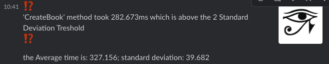

## Alerting
**Get Alerted by SLACK** 
<!-- Slack Notifications -->
Leave out the uncertainty of whether your application is running normally or offbeat with the integration of recieving slack notification. When processing time of any routes results in a time greater than two standard deviations from the norm, an automated slack message will be notified to your select channel or direct message. 

In addtion, all routes processed will have the time taken stored in a non-relational database to have a running log of the historic times used in dynically updating the alerting threshold.

**Metrics Shown in Notification**
An alert will be sent out with these key metrics:
  * specific functionality of application that is causing the issue
  * time it took to fulfull the request
  * trailing average time for functionality to complete
  * standard deivation of the processing time for functionality to complete

*Sample Message*

  

**Quick Setup**
1) Setup [Slack Webhook Account](https://api.slack.com/messaging/webhooks)
2) Setup [Mongo Database](https://docs.mongodb.com/manual/tutorial/getting-started)
3) Create .env file and paste your Slack webhook url and Mongo database url

